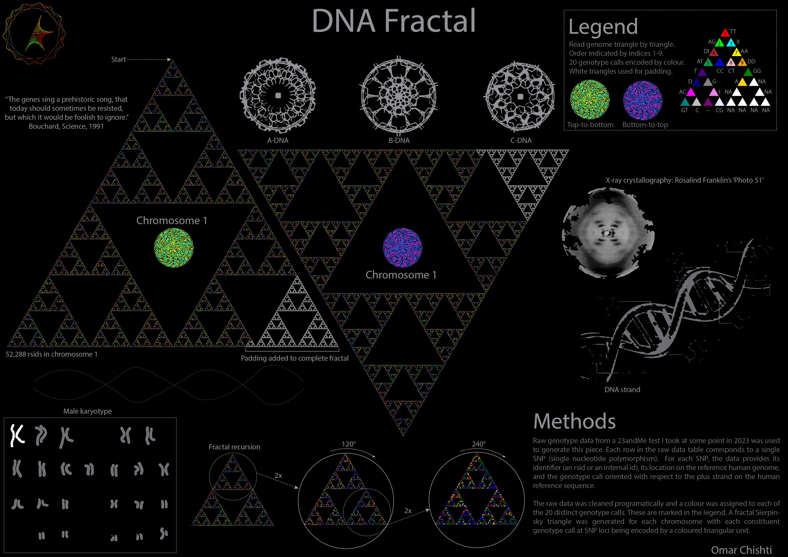
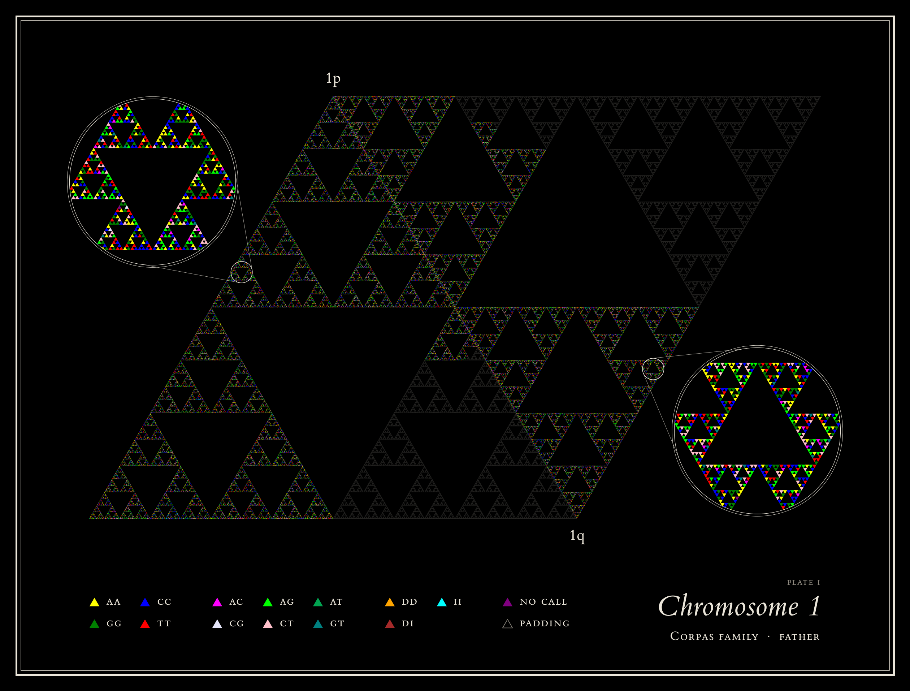
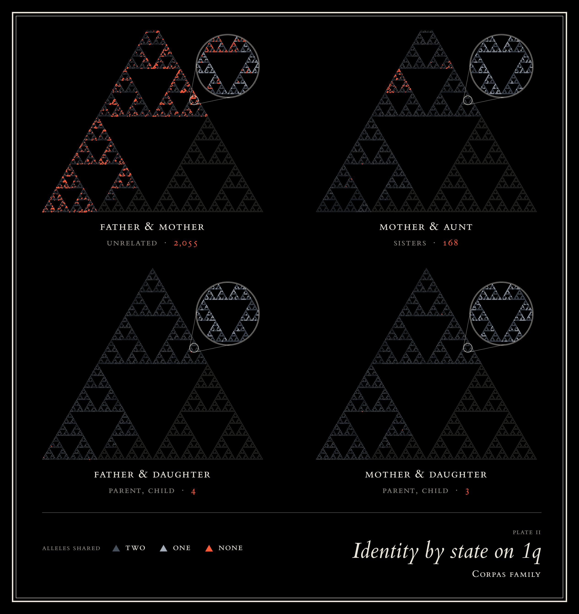

# dna-fractal



<!-- Opening paragraph: Omar's to write. -->

Each SNP in a 23andMe export becomes one triangle of a Sierpiński fractal, in the order the
subdivision visits its cells, so neighbouring SNPs sit side by side. The poster draws my own
chromosome 1. This repository runs on the Corpas family's public genotypes.





## Run

```bash
uv sync
uv run python scripts/fetch_corpasome.py   # five genotype files from figshare, checksummed
uv run jupyter lab notebooks/dna_fractal.ipynb
```

`scripts/make_figures.py` renders the plates without the notebook.

## Credits

- Genotypes: the Corpas family, public domain.
  [Corpas et al., *BMC Genomics*, 2015](https://doi.org/10.1186/s12864-015-1973-7);
  [figshare](https://doi.org/10.6084/m9.figshare.4491215).
- Based on work by Lora R Johnson.
- Type: [ETbb](https://ctan.org/pkg/etbb) by Michael Sharpe, after ET Book (MIT).

MIT licence.
